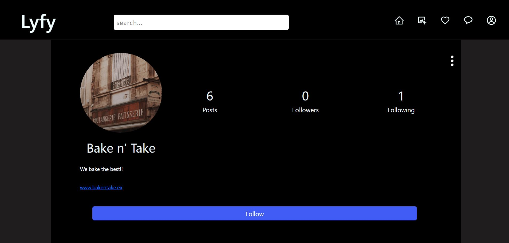
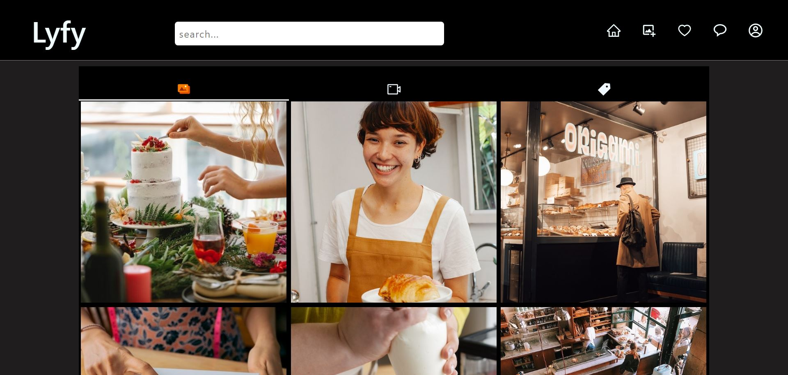
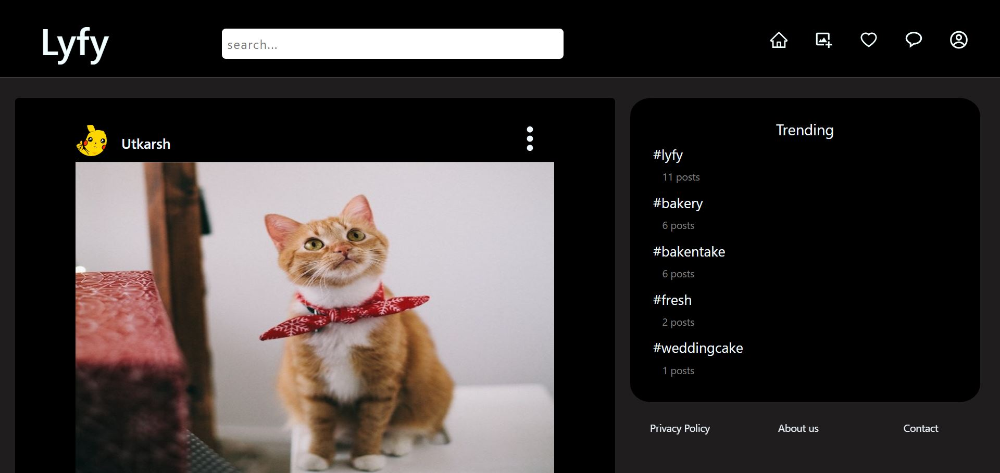
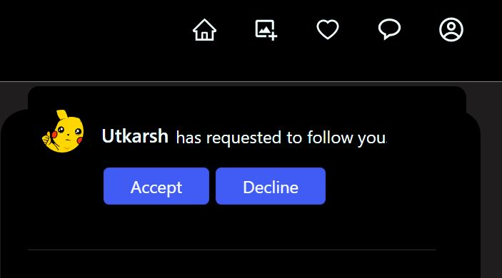
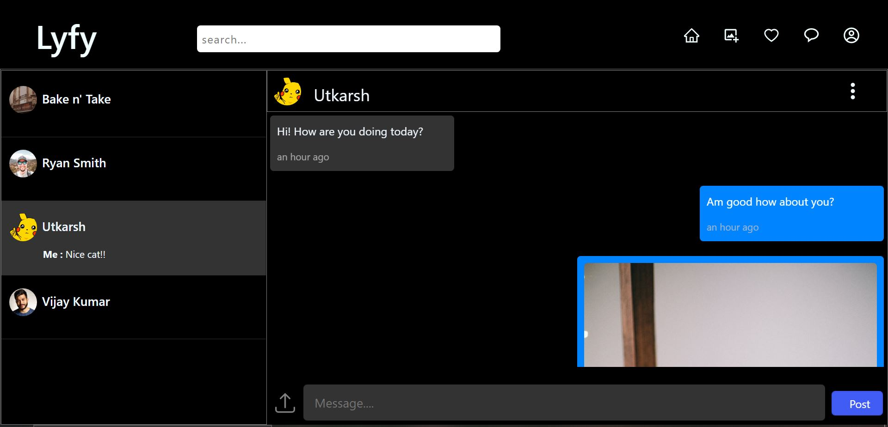
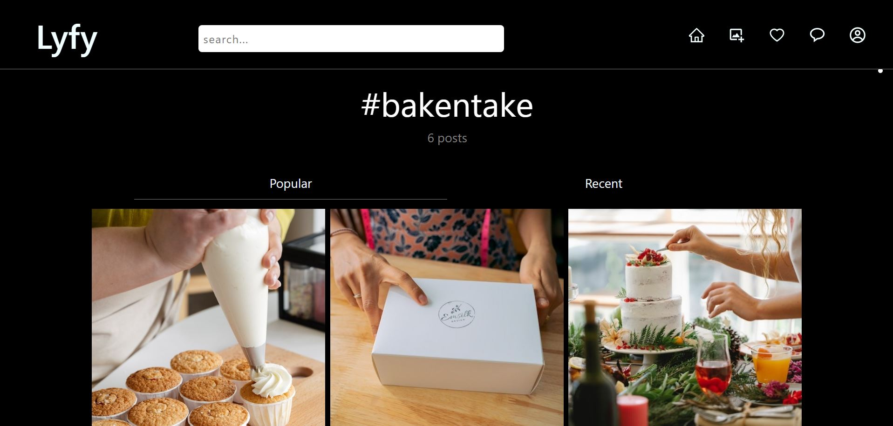
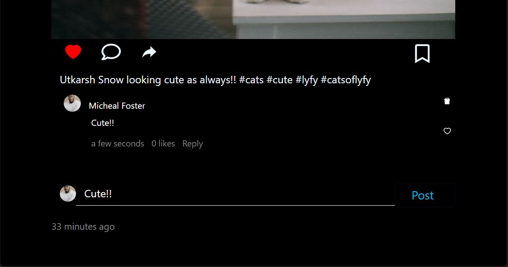
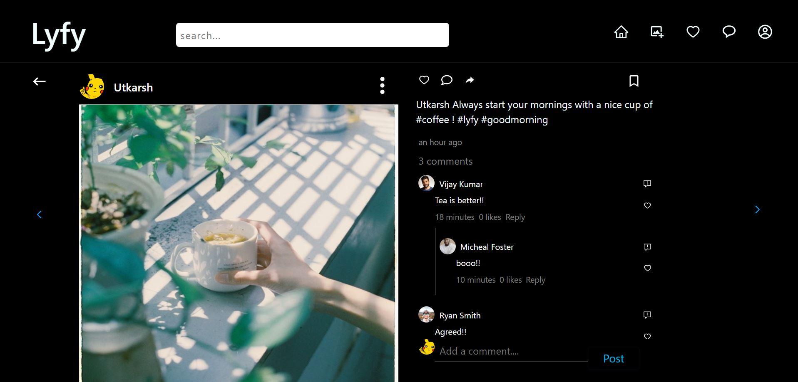
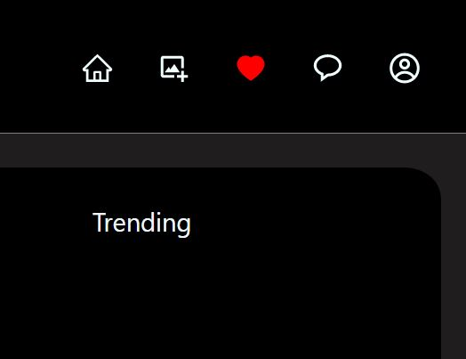
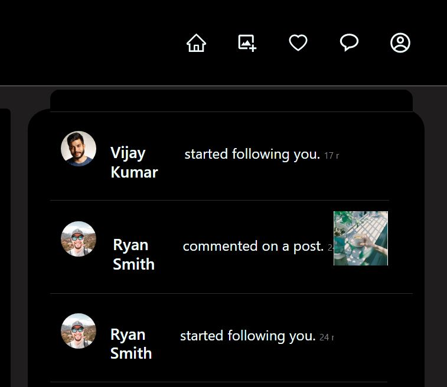

# Lyfy 

A social media app made using React js and firebase.
With a beautiful interface and important features Lyfy (spelled Liffey) is an app to connect you and your loved ones.

 Demo:[https://socialmedia-c27dd.web.app/](https://socialmedia-c27dd.web.app/)

## Features

User Profiles:

Share images

Private Accounts

Realtime chat

Hashtags

Post tools-Save, Comment and like

Conversation threads

Notifications

## Additional Features
Firebase transactions for data integrity
Turn off comments
Delete Posts
Block, mute or restrict Accounts
Remove followers
Change Password
Delete Account

