# Lyfy 

A social media app made using React js and firebase.
With a beautiful interface and important features Lyfy (spelled Liffey) is an app to connect you and your loved ones.

 Demo:[https://socialmedia-c27dd.web.app/](https://socialmedia-c27dd.web.app/)

# Latest Updates

## Post Videos
Now users can share videos in their posts.

## Serach for users in Chats 
Users can search for connections on chat page. They will also be able to see upto 3 non-connections with similar/same name.

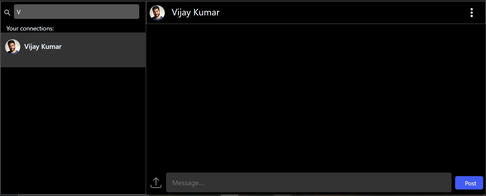

# Features

Basic requirements for a chatting app have been implemented using React js, Node and Firebase. These include but are not limited to :

## User Profiles:

Users are provided with a beautiful inteface to introduce themselves and add information like bio, website and name.

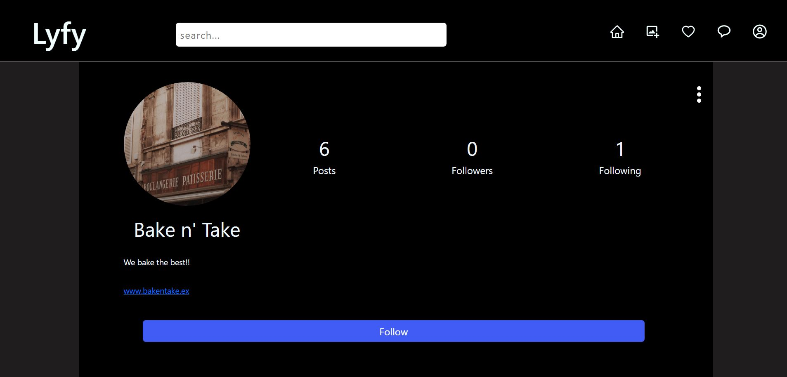

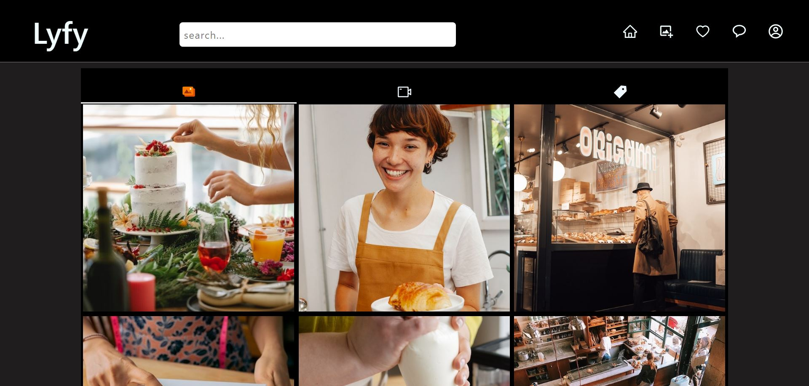

## Share images

Followers will see posts in their home feed. On the right side they see a panel with the top trending hastags.

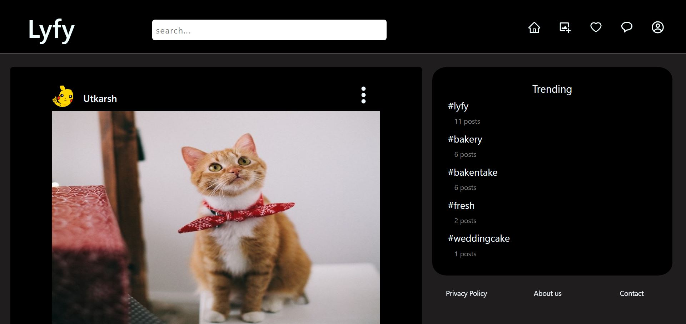

## Private Accounts

Privacy is important to everyone.Thats why its easy to go private on Lyfy and not let anyone follow you unless you accept their request.

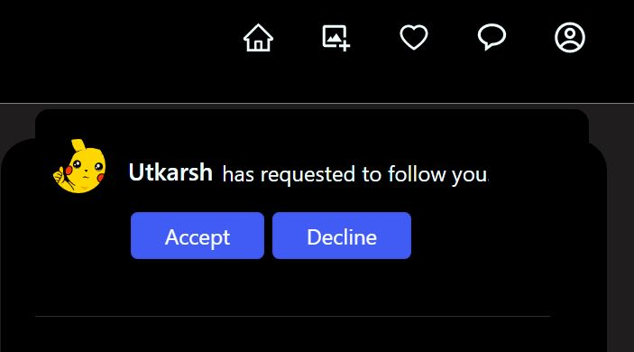

## Realtime chat

User's can talk to each other using Lyfy Messages and can even share photos to make convos interesting!!

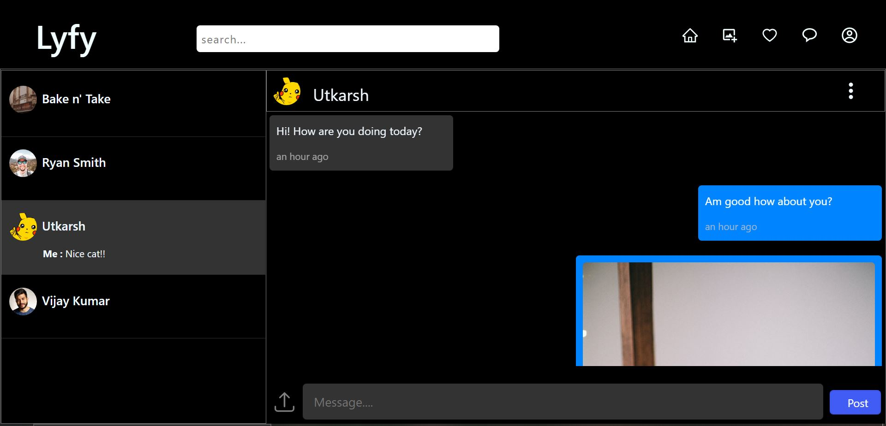

## Hashtags

We all type hatsags on out tweets, insta...Why not on Lyfy! Add hastags to your post and they are added on the specific tags page. Search for a tag and see posts related to the tags from all users.

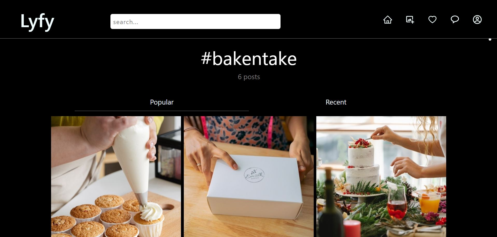

## Post tools-Save, Comment and like

Post tools include like, Comment and save.
Saved Posts appear under "Saved" section in the menu.

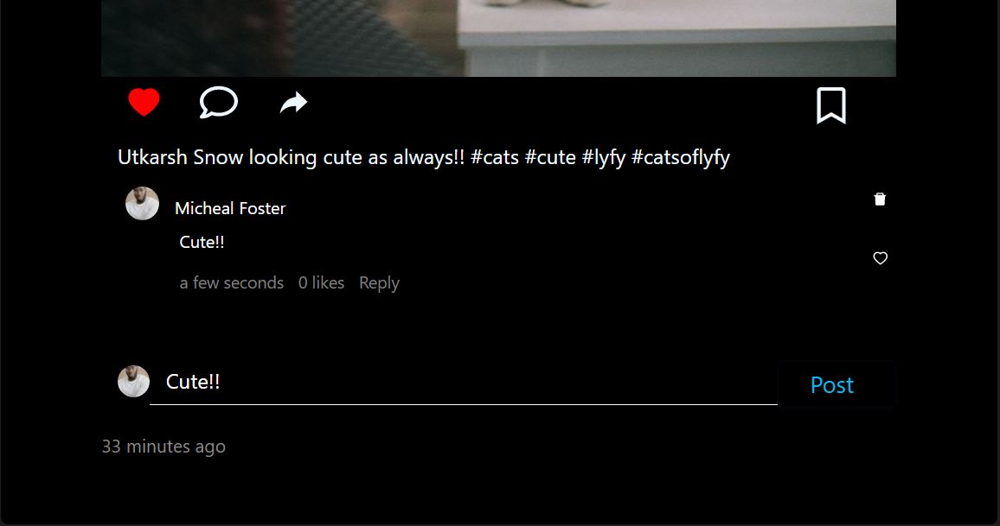

## Conversation threads

Single Comemnts are boring thats why we have conversations. Reply to comment or to a reply, it cann go on!

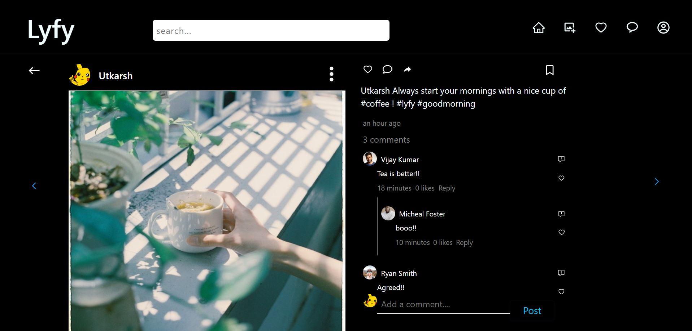

## Notifications

Notifications give important info about who followed you, likes your post, commented on your post or notify you about requests.

A red heart means you have new unopened notifications.

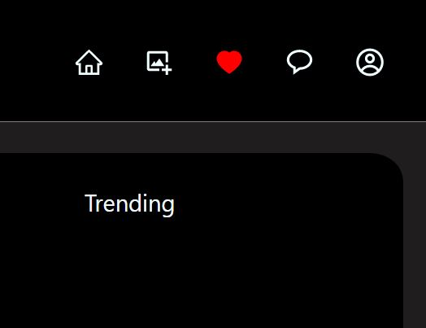

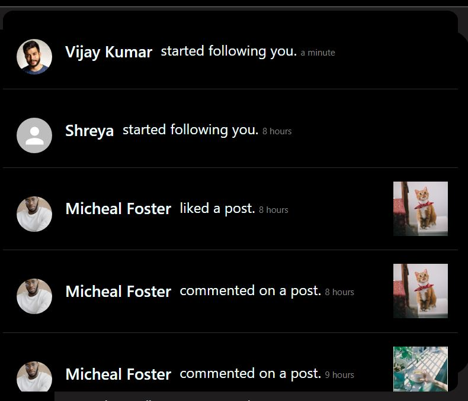

## Additional Features
### Firebase transactions for data integrity
### Turn off comments
### Delete Posts
### Block, mute or restrict Accounts
### Remove followers
### Change Password
### Delete Account

## Future

I plan to keep working on this application in my free time. Feel free to leave suggestions and reviews on the app in Help Center -> Message And requests.Some features to be updated are: stories and multimedia posts.
